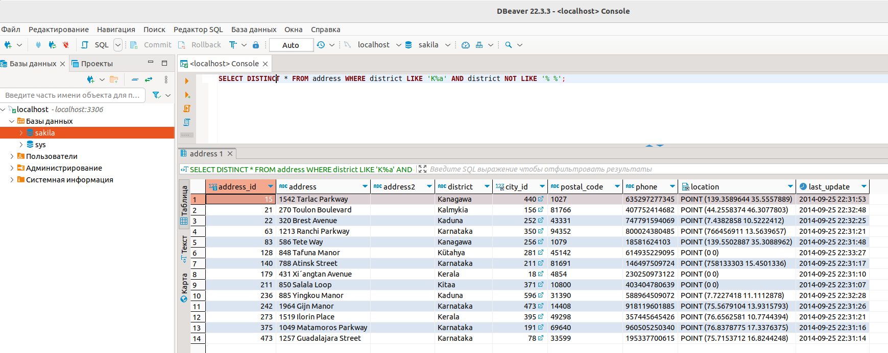
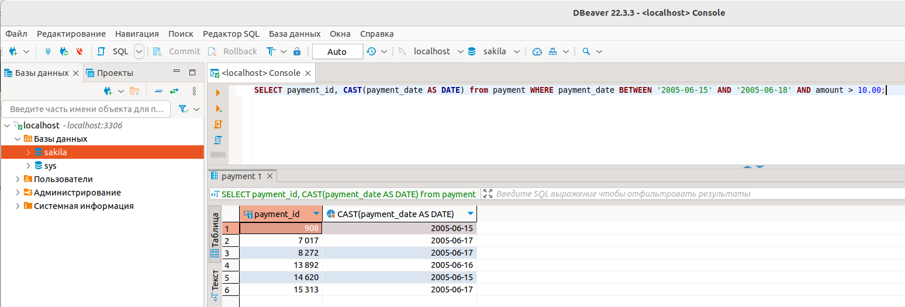
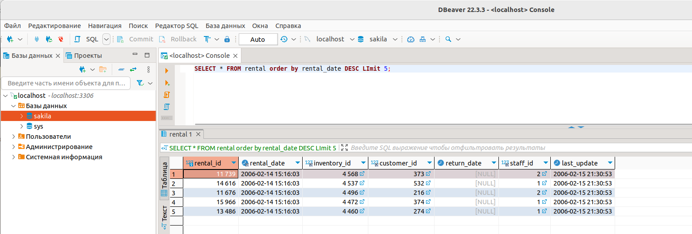
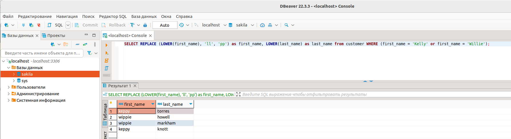

# Домашнее задание к занятию "SQL. Часть 1" - `Нагорнов Антон Алексеевич`

### Задание 1

SELECT DISTINCT * FROM address WHERE district LIKE 'K%a' AND district NOT LIKE '% %';  

### Задание 2

SELECT payment_id, CAST(payment_date AS DATE) from payment WHERE payment_date BETWEEN '2005-06-15' AND '2005-06-18' AND amount > 10.00;  

### Задание 3

SELECT * FROM rental order by rental_date DESC LImit 5;  

### Задание 4

SELECT REPLACE (LOWER(first_name), 'll', 'pp') as first_name, LOWER(last_name) as last_name from customer WHERE (first_name = 'Kelly' or first_name = 'Willie');  

